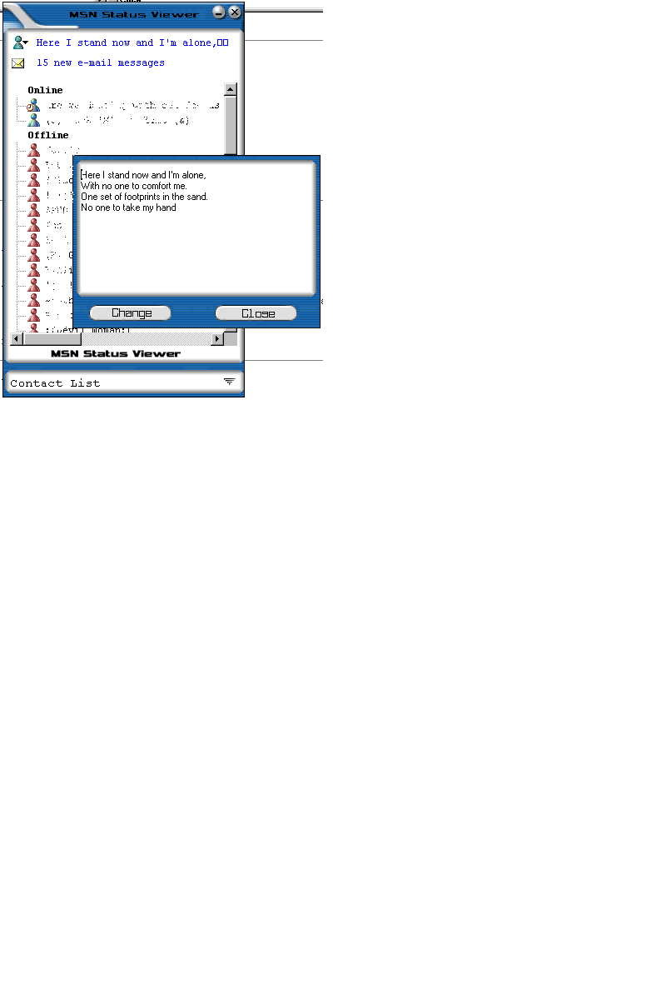



## MSN Status Viewer \(Second Release\)

### Description

MSN Status Viewer (Second Release)<see screenshot>

After releaseing the first one I realised it looked rather lame so I decided to add a skin to it and it looks cool!. anyways i fixed up some bugs from the old one and have added some more features and left some ideas (eg. Trojan) for any of those who want to use it. PLEASE COMMENT!!! i dont care about votes just feed back so please leave a comment.
 
### More Info
 

             |
---                |---
**Submitted On**   |1990-10-03 12:36:20
**By**             |[�e7eN](https://github.com/Planet-Source-Code/PSCIndex/blob/master/ByAuthor/e7en.md)
**Level**          |Beginner
**User Rating**    |5.0 (10 globes from 2 users)
**Compatibility**  |VB 6\.0
**Category**       |[Miscellaneous](https://github.com/Planet-Source-Code/PSCIndex/blob/master/ByCategory/miscellaneous__1-1.md)
**World**          |[Visual Basic](https://github.com/Planet-Source-Code/PSCIndex/blob/master/ByWorld/visual-basic.md)
**Archive File**   |[MSN\_Status329121122001\.zip](https://github.com/Planet-Source-Code/e7en-msn-status-viewer-second-release__1-28602/archive/master.zip)

